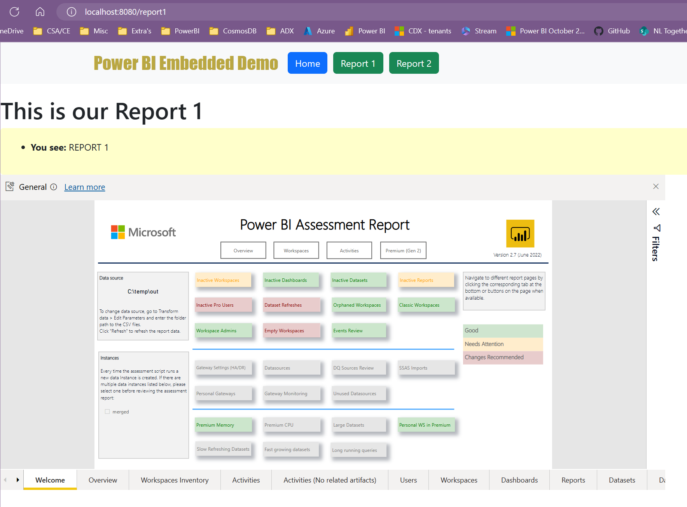

In frontend/public/Report1.png you can see the result of the report.

Minimum requirements: Python 3.6, Node.js 10.0.0+, npm 6.0.0+, Vue CLI 4.0.0+ (https://cli.vuejs.org/guide/installation.html) 

`.\venv\Scripts\activate` (activate virtual environment)

`pip install flask`

`pip install vue`
`npm install -g @vue/cli` (for `vue create frontend vue: The term 'vue' is not recognized as a name of a cmdlet, function, script file, or executable pr ogram.` issue)

Within the app.py file -> Ctrl + F5 and run the application

`vue create frontend`   -> Vue 3 

`cd frontend` -> `npm run serve`

Go to localhost:8080 (test it out)

`npm install bootstrap jquery popper.js` (while in the frontend folder)

`npm install vue-router@4` (while in the frontend folder)

`pip install flask-cors`

----- 

To run both the backend and the frontend:

Run **Flask** Server (backend) in one terminal: cd into the *backend* directory and run `python app.py`
Run **Vue** Server (frontend) in another parallel terminal: cd into the *frontend* directory and run `npm run serve`

-----
(https://stackoverflow.com/questions/60420338/embed-power-bi-dashboard-into-flask-application)

Yes, you can embed your power bi report in your flask web application. There are two methods to achieve this -

Embedding for your organization OR Embedding for your customers  ->[label](https://app.powerbi.com/embedsetup)
I will focus on the second method (it will require pro account):

Step 1: Register your power BI application here. Moreover, copy your application id.

Step 2: Then grant permissions to the application in azure portal.

Step 3: Collect the following variable details while performing the the above two steps -

workspace id
report id
tenant id
client id / application id (from step 1)
power bi account username
power bi account password

Step 4: You can use the sample flask web app provided by Microsoft for embedding.(Github link).

In this project you will have to provide the details (collected in step 3) in the file "config.py". However, this method requires a Pro license. The files that contain embedding code are in the folder Service and Models. The folder static and templates contains the front-end html and css code. Which you can always change as per your webpage, and the routes are managed in app.py

If you don't own a pro license then you can simply publish the report the on the web (which is not secure and everyone on the internet can view it). Then you will get an iframe code which you can inculcate in the html code of your flask web app (or any other web app).